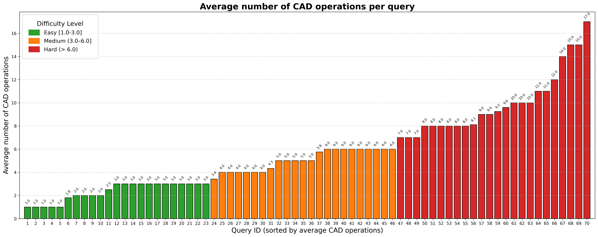
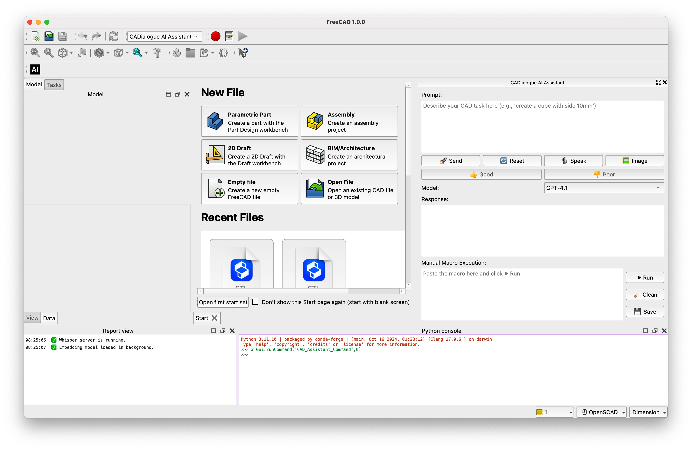

# CADialogue: A Multimodal LLM-Powered Conversational Assistant for Intuitive Parametric CAD Modeling

[](https://www.freecad.org/)
[]()
[]()

This repository contains the **official implementation of CADialogue**, the system introduced in our paper:

> **CADialogue: A Multimodal LLM-Powered Conversational Assistant for Intuitive Parametric CAD Modeling**  
> Jiwei Zhou, Jorge D. Camba, Pedro Company  
> *Computer-Aided Design*, Volume 191, 2026, 104006.  
> [https://doi.org/10.1016/j.cad.2025.104006](https://doi.org/10.1016/j.cad.2025.104006)

_**CADialogue**_ integrates **Large Language Models (LLMs)** with **FreeCAD** to enable conversational creation and refinement of parametric CAD models using:
- Natural language (text & speech),
- Image input,
- Direct geometry selection in the CAD workspace.

The assistant automatically generates and executes FreeCAD Python macros, supports iterative refinement (self- and human-in-the-loop), and caches confirmed results.


## 🔎 Abstract
Recent advances in generative Artificial Intelligence (AI)—particularly Large Language Models (LLMs)—offer a new paradigm for CAD interaction by enabling natural and intuitive input through texts, images, and context-aware selections. In this study, we present CADialogue, a multimodal LLM-powered conversational assistant to enable intuitive parametric CAD modeling through natural language, speech, image, and selection-based geometry interactions. Built on a general-purpose large language model, CADialogue translates user prompts into executable code to support geometry creation and context-aware editing. The system features a modular architecture that decouples prompt handling, refinement logic, and execution—allowing seamless model replacement as LLMs develop—and includes caching for rapid reuse of validated designs. We evaluate the system on 70 modeling and 10 editing tasks across varying difficulty levels, assessing performance in terms of accuracy, refinement behavior, and execution time. Results show an overall success rate of 95.71%, combining a 91.43% baseline under Text-Only input with additional recoveries enabled by Text + Image input, with robust recovery from failure via self-correction and human-in-the-loop refinement. Comparative analysis reveals that image input improves success in semantically complex prompts but introduces additional processing time. Furthermore, caching confirmed macros yields over 85.71% speedup in repeated executions. These findings highlight the potential of general-purpose LLMs for enabling accessible, iterative, and accurate CAD modeling workflows without domain-specific fine-tuning.


## ✨ Features
- **1. Multimodal Prompt Input**  
  📝 Natural language text, 🎙 speech (Whisper), and 🖼 images for intuitive design intent capture.

- **2. Cached Macro Retrieval**  
  💾 Semantic similarity search over previously confirmed macros for fast reuse - over **85.71× faster** than text-only LLM mode.

- **3. LLM-Powered Script Generation**  
  🤖 Backend-agnostic integration with GPT models (GPT-4.1, GPT-4o, etc.) to generate FreeCAD Python macros.

- **4. Script Validation**  
  ✅ Automatic syntax and geometry validation before execution in FreeCAD.

- **5. Auto-Refinement**  
  🔁 Self-correcting loop (up to 3 iterations) using error logs and failed CAD scripts.

- **6. Human-in-the-Loop Refinement**  
  🙋 Manual feedback via text, speech, or image corrections; optional call of AI-helper.

- **7. Model Review & Iteration Refinement**  
  👀 Interactive model inspection in FreeCAD; confirm (`👍 Good`) to cache or reject (`👎 Poor`) to regenerate.


## 🧩 System Architecture


## 📊 Dataset of Prompts

As part of this project, we curated a **70-query dataset** to evaluate CADialogue.
- Queries are categorized into **Easy** (23 prompts), **Medium** (23 prompts), and **Hard** (24 prompts) based on the **average number of CAD operations** for each texual prompt.
- Built upon Query2CAD (with selective refinements from LLM4CAD) and enriched with new prompts, this dataset ensures clearer geometric specifications and broader coverage.



👉 This dataset is included in the [dataset](./dataset/) folder and was used to generate the results reported in our paper.

## ⚡ Installation & Setup

### 0. Install FreeCAD
CADialogue requires **FreeCAD 1.0.0+** (we did not test any versions before 1.0.0).
Download and install it from the official site:
👉 [https://www.freecad.org/downloads.php](https://www.freecad.org/downloads.php)


### 1. Clone the repository
```
git clone https://github.com/Hiram31/CADialogue.git
cd CADialogue
```

### 2. Create a virtual environment
```
python3 -m venv .venv
source .venv/bin/activate  # macOS/Linux
# .venv\Scripts\activate   # Windows PowerShell
```

### 3. Install dependencies
```
pip install -r requirements.txt
```

### 4. Configure models
Edit model_configs.json to include your API key and endpoint, e.g.:
```
{
  "GPT-4.1": {
    "api_version": "your-azure-api-version",
    "api_key": "your-azure-api-key",
    "azure_endpoint": "https://your-endpoint.openai.azure.com/"
  },
  "GPT-4o": {
    "api_version": "your-azure-api-version",
    "api_key": "your-azure-api-key",
    "azure_endpoint": "https://your-endpoint.openai.azure.com/"
  }
}
```

### 5. Run FreeCAD in your terminal
For Mac:
```
/Applications/FreeCAD.app/Contents/MacOS/FreeCAD
```

## 🚀 Usage in FreeCAD
1. Open FreeCAD → Macro...
   - Update the `User macros location:` to `your-downloaded-repo-path/macros`
     - Execute `AutoLoadMyWorkbench.FCMacro` to launch CADialogue
   - Switch to CADialogue AI Assistant workbench
   - Click on `AI` icon to launch CADialogue
2. Use the docked panel:
    - Type a prompt and press 🚀 Send
    - Record a speech prompt with 🎙 Speak
    - Upload a reference image with 🖼 Image
3. The generated macro will:
   - Be executed in FreeCAD automatically,
   - Appear in the Response box,
   - Be available for refinement or manual execution.
4. Confirm good results with 👍 Good (cached), reject with 👎 Poor.



## 📝 Logging & Reproducibility
- All interactions are logged in the `logs` folder:
   - User/system messages,
   - Model outputs,
   - Macro cache (confirmed_macros.jsonl).
 - Refinement attempts and failures are also logged.

## 📌 Notes
- ✅ Tested on **macOS Sequoia (15.6.1)** with FreeCAD 1.0.0 and Python 3.10.  
- ⚠️ The project has **not been tested on Windows/Linux**.
- Tested with Azure OpenAI GPT-4.1 and GPT-4o; should work with other OpenAI-compatible APIs (requires minor changes to work with other open-weight models).

## 🙌 Citation
If you use this repo in your research, please cite:
```
@article{zhou2026cadialogue,
  title={CADialogue: A Multimodal LLM-Powered Conversational Assistant for Intuitive Parametric CAD Modeling},
  author={Zhou, Jiwei and Camba, Jorge D. and Company, Pedro},
  journal={Computer-Aided Design},
  volume={191},
  year={2026},
  pages={104006},
  doi={10.1016/j.cad.2025.104006}
}
```